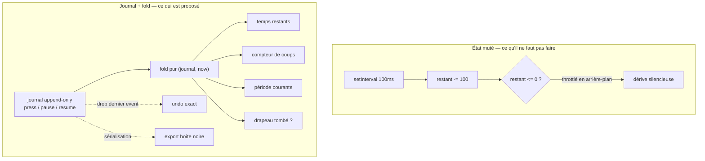
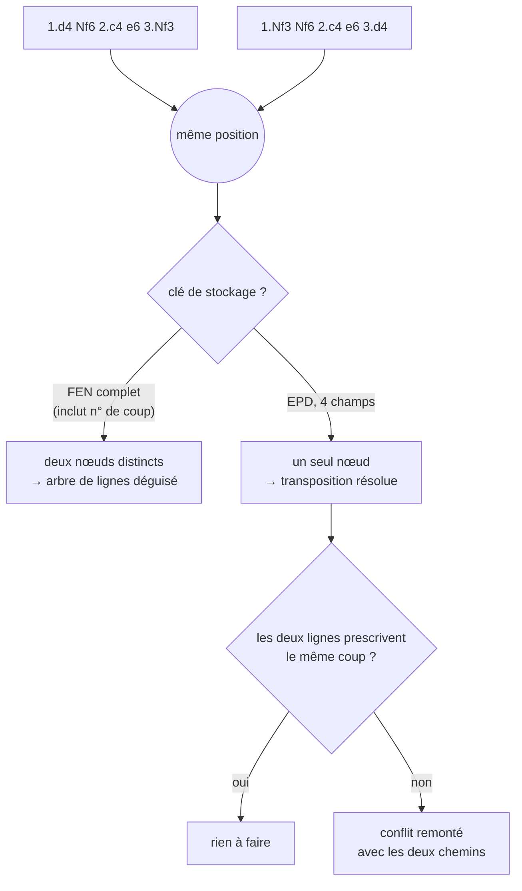

# Ideation: myChess — pendule et répertoire d'ouvertures

## Grounding Context

**Topic context.** Application d'échecs personnelle, développée en solo le soir. PWA offline-first (Vite + TypeScript + Vitest + pnpm, Svelte si l'UI le justifie), installée sur un téléphone Android via « Ajouter à l'écran d'accueil ». Ni natif Kotlin ni Capacitor : le poste n'a aucune toolchain Android, et rien dans ces deux fonctions ne l'exige. Utilisateur unique, pas de compte, pas de marché — donc liberté totale sur les compromis produit, et possibilité d'être plus exigeant qu'un produit de masse.

Deux fonctions d'ampleur très inégale : une **pendule** (livrée en premier, autonome, aucune logique échiquéenne) et un **répertoire d'ouvertures** (5 à 10× l'effort, à forte valeur). Contrainte de vérification : pas de suite de tests automatisée sur les projets existants — la preuve passe par le pilotage réel de l'application.

**Learnings mobilisés.** Le corpus personnel contient quatre patterns directement applicables : le *catch-up tick* d'Idle Crusade (Chrome throttle `setInterval` à ~1×/min après 5 min en arrière-plan ; `tickMs` doit être un entier constant sous peine de corruption par accumulation) ; le blowout de grille CSS de Carillon (`minmax(min-content, 1fr)`, et tester sur les deux axes, pas seulement la largeur) ; la vérification responsive réelle (`scrollWidth <= innerWidth` est masqué par `overflow-x: hidden` ; un audit nomme les éléments cassés, il ne rend pas un booléen) ; et le piège de réactivité Svelte des dépendances lues en closure, invisibles à l'analyse statique de `$:`. Rien dans le corpus sur la répétition espacée, le parsing PGN/FEN, la Web Audio, la Vibration API ni le Screen Wake Lock — terrain vierge.

**Prior art externe.** getchessclock.com implémente déjà l'ergonomie visée (téléphone à plat, moitié adverse à 180°, offline), ce qui prouve la viabilité PWA du cas d'usage. Timely prévient les taps accidentels par un double-tap. Côté répertoire, Chessbook est le prior art structurellement pertinent : il traite un répertoire comme une collection de positions, pas de lignes. Chessable, à l'inverse, concentre les plaintes documentées — ordonnancement mal calibré, et échec de rétention à long terme attribué à l'absence de « l'histoire derrière les coups ».

**Contraintes de plateforme.** Le Wake Lock est best-effort et auto-relâché dès que l'onglet est masqué : il empêche l'écran de s'éteindre, il ne peut pas servir de mécanisme de timing. La Vibration API fonctionne sur Chrome Android et son exigence de geste utilisateur est satisfaite par le tap lui-même. Les dumps de l'explorateur d'ouvertures Lichess pèsent 2,9 Go (masters) à 22 Go — inembarquables dans une PWA, ce qui force une décision produit sur le comportement hors ligne. Un Stockfish mono-thread évite entièrement la plomberie COOP/COEP. Rien ne bloque l'une ou l'autre fonction en PWA.

---

## Topic Axes

1. Justesse du temps — cadences, calcul par deadline, rattrapage après mise en arrière-plan, chute du drapeau, transitions multi-période, comptage des coups.
2. Ergonomie de table — téléphone à plat, rotation 180°, taps et prévention du mis-tap, retours sonores/haptiques/visuels, lisibilité, cycle de vie de la partie.
3. Modélisation du répertoire — origine des lignes, position contre ligne, clé de stockage, transpositions, trous de couverture, répertoires blanc et noir.
4. Entraînement et mémorisation — drill, ordonnancement, feedback, compréhension contre récitation, mesure du progrès réel.
5. Socle PWA et vérification — installation et hors-ligne, stockage et migration, wake lock, harnais de vérification sans tests automatisés.

---

## Ranked Ideas

1. [La pendule est un journal d'événements, pas un état qu'on décrémente](#1-la-pendule-est-un-journal-dvnements-pas-un-tat-quon-dcrmente)
2. [La clé du répertoire est un EPD, pas un FEN — et la contradiction est une fonctionnalité](#2-la-cl-du-rpertoire-est-un-epd-pas-un-fen--et-la-contradiction-est-une-fonctionnalit)
3. [Le temps est une entrée du système, pas une horloge qu'on subit](#3-le-temps-est-une-entre-du-systme-pas-une-horloge-quon-subit)
4. [Le répertoire est la seule donnée irremplaçable — il n'a aujourd'hui aucune sauvegarde](#4-le-rpertoire-est-la-seule-donne-irremplaable--il-na-aujourdhui-aucune-sauvegarde)
5. [Le canal de retour d'une pendule posée à plat n'est pas l'écran](#5-le-canal-de-retour-dune-pendule-pose--plat-nest-pas-lcran)
6. [Aucun coup n'entre au répertoire sans sa raison écrite](#6-aucun-coup-nentre-au-rpertoire-sans-sa-raison-crite)
7. [Entraîner la détection, pas la récitation](#7-entraner-la-dtection-pas-la-rcitation)

### 1. La pendule est un journal d'événements, pas un état qu'on décrémente

**Description :** Ne jamais stocker « il reste 4:32 à Blanc ». Stocker un journal immuable d'événements horodatés — `{type: 'press' | 'pause' | 'resume', at: epochMs, by: side}` — et dériver l'intégralité de l'affichage par un `fold` pur sur ce journal. Temps restants, compteur de coups, transitions de période et chute du drapeau deviennent tous des lectures du même journal. Le `setInterval` ne fait que redessiner ; il ne fait jamais avancer le temps. La persistance sauvegarde le journal, pas l'état dérivé.

Trois conséquences tombent gratuitement. Le **compteur de coups** n'est plus un état à maintenir : chaque tap *est* l'événement « un coup vient d'être joué ». L'**undo d'un mis-tap** devient un `drop` du dernier événement suivi d'un replay, qui restitue le temps exact — c'est la meilleure réponse au tap accidentel, et elle ne taxe aucun coup. Et la **chute du drapeau constate sans arbitrer** : l'application arrête et signale, elle n'affiche pas de vainqueur.

**Axis :** Justesse du temps

**Basis :** `direct:` grounding — « La logique de pendule doit être basée sur une deadline/timestamp […] jamais un compteur de ticks `setInterval`. Table-stakes, pas optionnel. » Combiné au learning L1 d'Idle Crusade (rattrapage `Math.floor((now - lastTickAt) / tickMs)`, `tickMs` entier constant) et à L5 (« séparer la logique pure `parseSave(raw)` de l'accès au stockage »). `external:` FIDE, Laws of Chess art. 6.9 — la partie est nulle si l'adversaire ne peut mater par aucune suite de coups légaux, même drapeau tombé ; et Appendice B (blitz) — « The flag is considered to have fallen when a player has made a valid claim to that effect », la chute est réclamée, pas constatée par l'appareil. `reasoned:` analogie de la comptabilité en partie double : on n'édite jamais un solde, on écrit une écriture et on recalcule. L'invariant `temps écoulé = consommé Blanc + consommé Noir + pause` est vérifiable en continu sur un journal, impossible à prouver sur un état muté.

**Rationale :** Quatre des cinq lentilles d'idéation ont convergé indépendamment sur cette structure, ce qui est le signal le plus net du run. Elle fait disparaître le chemin de rattrapage séparé que L1 a coûté cher à apprendre : un `fold` est idempotent, rejouer après vingt minutes d'arrière-plan donne le même résultat qu'en direct. Et pour une pendule, la classe de bug que L1 documente ne produit pas un score légèrement faux — elle produit un drapeau tombé à tort, la seule chose qu'une pendule n'a pas le droit de rater.

**Downsides :** Le journal croît pendant la partie (négligeable : quelques centaines d'événements). Recalculer par `fold` à chaque frame est gaspilleur si on ne mémoïse pas le préfixe stable. Surtout, la discipline est absolue : une seule écriture d'état dérivé quelque part et l'invariant tombe sans prévenir.

**Confidence :** 92%
**Complexity :** Medium

---

### 2. La clé du répertoire est un EPD, pas un FEN — et la contradiction est une fonctionnalité

**Description :** Indexer les positions du répertoire par les **quatre premiers champs** du FEN — placement des pièces, trait, droits de roque, case en passant — c'est-à-dire un EPD, et non le FEN complet. Les coups sont des arêtes entre positions ; la structure est un graphe orienté acyclique, pas un arbre de lignes.

Ce détail décide si l'idée marche. Un FEN complet contient le compteur de demi-coups et le numéro de coup, qui **diffèrent entre deux transpositions vers la même position**. Prendre le FEN complet comme clé fait échouer la convergence en silence, et reconstruit exactement l'arbre de lignes qu'on voulait éviter.

Second volet : dès qu'on unifie par position, les contradictions apparaissent mécaniquement. Deux lignes construites à six mois d'écart transposent vers la même position et y prescrivent deux coups différents — le store ne peut en garder qu'un. Ne pas trancher silencieusement : lever un conflit à résoudre, avec les deux chemins d'arrivée affichés, à la manière d'un conflit de merge.

**Axis :** Modélisation du répertoire

**Basis :** `direct:` grounding — « clé du store par FEN (position), pas par séquence de coups — c'est un DAG, pas un arbre — la seule approche qui évite la comptabilité manuelle des transpositions », corroboré par Chessbook qui « traite explicitement un répertoire comme une collection de coups/positions, pas une collection de lignes ». `reasoned:` la correction EPD est arithmétique et vérifiable : deux transpositions vers une même position diffèrent nécessairement sur les champs 5 et 6 du FEN dès que les ordres de coups diffèrent en longueur ou en captures, donc une clé qui les inclut ne peut pas les unifier. Le volet conflit vient du modèle git : quand deux histoires indépendantes touchent le même objet de façon divergente, l'outil refuse d'arbitrer et remonte à l'auteur — un répertoire construit ligne par ligne sur plusieurs mois *est* une histoire à branches multiples qui converge.

**Rationale :** C'est la décision de schéma la plus porteuse du projet : la couverture, le calendrier de révision, le verdict de drill et l'agrégation des statistiques en dépendent tous. Se tromper ne se corrige pas par un patch — cela signifie réécrire la détection de trous, le scoring et l'agrégation en même temps, sur des données de révision réelles. Et le conflit de transposition est le seul moment où l'outil peut détecter que le répertoire est incohérent avec lui-même : un coût caché du graphe transformé en garde-fou.

**Downsides :** Une question reste ouverte et doit être tranchée avant d'écrire la première table : la clé est-elle l'EPD seul, ou le couple `(EPD, couleur du répertoire)` ? Une même position peut appartenir au répertoire blanc et au répertoire noir avec des intentions différentes. Par ailleurs, une UI de résolution de conflits est du travail réel, pas une case à cocher.

**Confidence :** 90%
**Complexity :** Medium

---

### 3. Le temps est une entrée du système, pas une horloge qu'on subit

**Description :** Le moteur de temps reçoit sa source de temps en paramètre — une interface `Clock` — et n'appelle jamais `Date.now()` en dur. On déroule alors une partie multi-période de trois heures en quelques millisecondes dans Vitest, et on injecte les scénarios qu'on ne peut pas provoquer à la main : trente minutes de throttling, chute du drapeau pendant un délai Bronstein, tap trois millisecondes avant l'échéance, franchissement du quarantième coup pendant un délai, reprise depuis un journal tronqué.

Le corollaire, une fois le journal de l'idée 1 en place, coûte une sérialisation : **exporter le journal en un tap** après un incident réel au club. Un journal exporté se rejoue tel quel comme fixture de non-régression.

**Axis :** Socle PWA et vérification

**Basis :** `direct:` le point de douleur est nommé — pas de suite de tests automatisée, la vérification passe par le pilotage réel de l'application. Et L5 documente le contournement actuel : « booster temporairement une constante de balance pour exercer un chemin lent — revert systématique avant commit ». `reasoned:` c'est la version principielle de ce hack, empruntée à la simulation en temps accéléré des systèmes embarqués : un système embarqué ne peut pas non plus attendre le temps réel pour se valider, sa parade est de faire du temps une entrée. Le seam supprime le revert, donc supprime le risque qu'une constante boostée fuie dans un commit. Le volet export emprunte à l'enregistreur de vol : un bug de pendule survient au club, loin du poste de dev, et n'est jamais reproductible.

**Rationale :** La pendule est le seul domaine purement déterministe du projet. C'est précisément là que le coût d'un test est quasi nul et la vérification manuelle quasi impossible — on ne reproduit pas à la main un throttling de trente minutes ni un tap à trois millisecondes du drapeau. Sur un projet sans tests, c'est le seul endroit où en écrire est franchement rentable, et cela délimite proprement le partage : ce qui est temporel devient vérifiable à froid, ce qui est tactile et spatial reste vérifié à la main sur le téléphone.

**Downsides :** Coût quasi nul si le seam est posé d'emblée, coût de refactor réel s'il est ajouté après. Le seam ne dit rien de l'ergonomie, qui reste entièrement à vérifier à la main. L'export ne vaut que si l'idée 1 est retenue — sans journal, il n'y a rien à exporter.

**Confidence :** 88%
**Complexity :** Low

---

### 4. Le répertoire est la seule donnée irremplaçable — il n'a aujourd'hui aucune sauvegarde

**Description :** Le journal de la pendule est jetable : une partie finie ne vaut rien. Le répertoire, lui, représente des mois de soirées et ne se reconstitue pas. Or tel que le projet est cadré, il vivrait dans l'IndexedDB d'un seul téléphone — que Chrome peut évincer sous pression de stockage, et qui se perd avec l'appareil.

Trois mesures, par coût croissant : appeler `navigator.storage.persist()` pour demander le stockage durable ; offrir un export/import complet du répertoire en un fichier JSON ou PGN ; et faire de cet export une action de routine, pas une fonction cachée dans un menu.

S'y rattache un risque opérationnel jumeau : une PWA installée sert un build périmé pendant des semaines si la stratégie de mise à jour du service worker n'est pas explicite. Un service worker périmé combiné à une migration de schéma donne une perte de données silencieuse. Le couplage version d'application / version de schéma doit être posé, pas découvert.

**Axis :** Socle PWA et vérification

**Basis :** `reasoned:` argument de conservation. Le grounding pose l'offline-first et le stockage local comme acquis, mais aucune source ni aucun learning du corpus ne traite la durabilité de ce stockage — c'est un angle mort, pas une décision prise. Or les deux propriétés qui rendent la donnée précieuse (accumulée lentement, jamais reconstituable) et les deux propriétés du support (éviction possible par le navigateur, appareil unique) se composent en un risque de perte totale. `direct:` L5 impose déjà de « prévoir le versioning/migration dès le départ » — mais le versioning protège contre une migration ratée, pas contre une éviction ni contre un téléphone perdu ; ce sont deux risques distincts et un seul est couvert.

**Rationale :** C'est le seul risque du lot dont la réalisation est irréversible. Toutes les autres idées se corrigent par un refactor ; celle-ci, non — la donnée perdue est perdue. Et le coût de la mitigation est dérisoire au regard de l'enjeu : `navigator.storage.persist()` est un appel, l'export un sérialiseur.

**Downsides :** `navigator.storage.persist()` est une demande, pas une garantie — le navigateur peut refuser, et l'accorder plus volontiers à une PWA installée qu'à un onglet. Un export manuel qu'on oublie de faire ne protège de rien : la vraie question est de le rendre routinier, ce qui est un problème d'usage et pas de code.

**Confidence :** 85%
**Complexity :** Low

---

### 5. Le canal de retour d'une pendule posée à plat n'est pas l'écran

**Description :** Téléphone à plat entre deux joueurs qui fixent l'échiquier : personne ne regarde la pendule. Deux conséquences distinctes.

**Confirmer le transfert à celui qui vient de jouer.** Tout le prior art traite le faux positif — le tap accidentel. Personne ne traite le faux négatif : le tap qui n'a pas pris. C'est pourtant le vrai risque quand on tape à l'aveugle, la main revenant vers les pièces. Le double-tap aggrave même ce cas. Le canal ne peut pas être haptique — il n'y a qu'un vibreur dans un téléphone posé entre deux joueurs, les deux le sentent : il doit être **visuel sur la moitié du cédant** (son cadran se fige visiblement, sa moitié s'assombrit), perceptible en vision périphérique.

**Signer les transitions d'état par le son.** La bascule au quarantième coup qui ouvre trente minutes est l'information la plus critique et la plus invisible du dispositif. Signatures sonores distinctes pour : transition de période, entrée en survie sur incrément seul, dix dernières secondes, chute du drapeau.

**Axis :** Ergonomie de table

**Basis :** `direct:` grounding — « Easy Chess Timer ajoute un retour haptique au tap » ; « Vibration API : fonctionne bien sur Chrome Android […] nécessite un geste utilisateur — satisfait par le tap lui-même » ; et la contrainte de cadence multi-période. Plus l'absence notable : aucun learning du corpus sur la Web Audio ni la Vibration API, donc du risque non estimé sur ce qui n'est pas un habillage mais la condition d'usage de la multi-période. `external:` protocole aviation du transfert positif de contrôle — un hand-off n'est complet que lorsque le cédant a reçu confirmation. La similarité tient : deux parties, une ressource unique et critique, transfert fréquent, et le même mode d'échec — personne ne pense consommer du temps alors que le temps de quelqu'un s'écoule.

**Rationale :** Reclasser le son de « finition » en « sans quoi la multi-période est inutilisable » change l'ordre des priorités. Et le diagnostic du faux négatif est le seul angle du prior art que personne n'a couvert, ce qui en fait le point où un outil personnel peut faire mieux que ce qui existe.

**Downsides :** Chrome Android *freeze* une page cachée après quelques minutes : le bip de drapeau pendant une longue réflexion écran éteint risque de ne jamais partir, et la Web Audio ne peut pas démarrer un son dans une page gelée. Il faut pré-armer l'audio au premier geste et accepter explicitement que le signal sonore ne soit pas garanti hors premier plan. Manque aussi un mode silencieux : un bip dans une salle de club est antisocial.

**Confidence :** 78%
**Complexity :** Medium

---

### 6. Aucun coup n'entre au répertoire sans sa raison écrite

**Description :** Un coup ne peut être ajouté au répertoire qu'accompagné d'une ligne de justification rédigée à la main — pas importée, pas générée. « Je prends l'espace avant qu'il ne joue ...c5 » ; « seule case où le Fou n'est pas mordu par h6 ». Le drill interroge alors *parfois la raison plutôt que le coup*, avec révélation différée : on énonce d'abord, l'application montre ensuite ce qu'on avait écrit. Un coup dont la raison n'a jamais pu être reformulée est signalé comme fragile, indépendamment de son taux de rappel.

**Axis :** Entraînement et mémorisation

**Basis :** `direct:` grounding — des utilisateurs Chessable de longue date « rapportent un échec de rétention ("il manque l'histoire derrière les coups") », dont le grounding tire que « la mémorisation pure de coups sans compréhension positionnelle se dégrade avec le temps ». C'est la plainte la mieux documentée de tout le prior art. `reasoned:` deux mécanismes combinés. L'Architecture Decision Record rend la justification *bloquante à l'écriture* — c'est ce qui distingue un ADR d'un commentaire, et ce qui force l'effort d'élaboration au moment de l'encodage plutôt qu'après coup. Et le débriefing d'après-action demande « qu'est-ce que tu voulais faire », pas « qu'est-ce qui s'est passé ».

**Rationale :** C'est une voie que les produits de masse ne peuvent pas emprunter — un champ obligatoire rédigé à la main détruirait leur taux de conversion — et qui est un avantage net pour un outil à un seul utilisateur. Elle donne aussi une seconde métrique de progrès à côté du rappel : la proportion du répertoire dont on sait redire le pourquoi, bien plus corrélée à ce qui sert en partie. Effet de bord voulu : la friction freine mécaniquement le gonflement du répertoire, problème réel pour qui ajoute des lignes plus vite qu'il ne les révise.

**Downsides :** C'est de la friction délibérée, à assumer entièrement ou à ne pas faire du tout — un champ obligatoire qu'on remplit par `xxx` est pire que pas de champ. Évaluer une raison reformulée est nécessairement auto-évalué, donc moins fiable qu'un coup juste ou faux.

**Confidence :** 75%
**Complexity :** Low

---

### 7. Entraîner la détection, pas la récitation

**Description :** Un mode où l'application joue une partie depuis le premier coup et sort du répertoire à un moment **imprévisible** — c'est au joueur de remarquer qu'il n'est plus en terrain connu, pas à l'application de le lui dire. Le résultat mesuré n'est pas « coup juste ou faux » mais « as-tu vu que la position avait quitté ton répertoire, et à quel coup ».

Cela suppose un verdict gradué plutôt que binaire, sur quatre niveaux : coup du répertoire / **transposition dans une autre de tes propres lignes** (juste — le graphe le sait, et un trainer naïf le sanctionnerait à tort) / coup jouable hors répertoire / erreur.

**Axis :** Entraînement et mémorisation

**Basis :** `external:` littérature sur l'entraînement à l'imprévu — Landman et al. (2018), *Training Pilots for Unexpected Events: A Simulator Study on the Advantage of Unpredictable and Variable Scenarios*, et les travaux de la Flight Safety Foundation. Le résultat est que c'est **l'imprévisibilité du scénario** qui produit le gain de performance, précisément parce que la prévisibilité fournit l'indice. `reasoned:` le mécanisme porté est la suppression de l'indice de contexte. Une flashcard de répertoire est un test *cued* : le simple fait qu'on te montre une position te dit qu'il y a un coup de répertoire à retrouver. En partie réelle cet indice n'existe pas — le signal à produire n'est pas le coup, c'est la détection qu'on est encore, ou déjà plus, en terrain connu. C'est un objectif d'entraînement à deux étages dont le drill classique n'entraîne que le second.

**Rationale :** Avec l'idée 6, c'est ce qui donne au trainer une raison d'exister plutôt que d'utiliser Chessable. La compétence utile en tournoi n'est pas de réciter vingt coups, c'est de savoir à quel coup exactement on a quitté la carte. C'est aussi le mode le plus difficile à copier pour un produit de masse : jouer une partie entière est long et ne produit pas de belles statistiques de série.

**Downsides :** Le coût réel est supérieur à ce que le résumé suggère, et il est caché ailleurs : pour sortir du répertoire à un moment imprévisible, l'application doit jouer un coup plausible **qui n'est pas dans le store** — donc disposer d'une source de coups adverses. Explorateur Lichess (réseau), jeu ECO embarqué, ou moteur : c'est exactement la décision sur le comportement hors ligne, et elle devient bloquante pour ce mode. À noter que détecter qu'on est hors répertoire ne demande **aucun** moteur — c'est un échec de lookup dans son propre store ; le moteur ne servirait qu'à juger la qualité d'un coup hors livre.

**Confidence :** 72%
**Complexity :** High

---

## Rejection Summary

| # | Idée | Raison du rejet |
|---|---|---|
| 1 | La cadence est une chaîne parsée selon la grammaire `TimeControl` du PGN | Base réfutée : le tag existe bien en §9.6.1, mais la forme composée `40/5400+30` n'y est pas définie et le standard réserve l'incrément au dernier descripteur. Une fois inventés l'incrément-dans-période, Bronstein et le délai américain, il ne reste du standard qu'un nom trompeur. |
| 2 | Presets figés en JSON versionné avant tout éditeur | Retenue en pratique, pas comme idée : c'est la bonne décision d'expédition mais elle ne passe pas le test de discussion. La seule part non évidente — sérialiser le preset dans le hash d'URL pour avoir un raccourci d'écran d'accueil par cadence — se greffe en une ligne. |
| 3 | Double-tap pour terminer son tour | Prior art réel mais strictement dominé : taxe un tempo à chaque coup en blitz, aggrave le faux négatif identifié en idée 5, et résout un problème que l'undo de l'idée 1 règle mieux et gratuitement. |
| 4 | Le répertoire est récolté dans ses propres parties, sans UI d'édition | Réfutée comme source de vérité : un répertoire dérivé de ses parties enregistre ce qu'on **a** joué, mauvaises habitudes comprises, alors qu'un répertoire est ce qu'on **devrait** jouer. Le garde-fou proposé ne se déclenche jamais sur une erreur jouée systématiquement. Excellente comme amorçage contre le démarrage à froid — à reprendre sous cet angle. |
| 5 | Blame de provenance sur chaque coup | La citation invoquée (« il manque l'histoire derrière les coups ») porte sur l'explication, pas sur la citation de source : savoir qu'un coup vient d'une partie de maître ne restitue aucune histoire. C'est l'idée 6 qui répond à cette plainte. |
| 6 | Débloquer une branche fille seulement quand le parent atteint un seuil de rétention | Contradiction interne : dans un graphe orienté acyclique — la structure qu'impose l'idée 2 — un nœud a plusieurs parents, donc « le parent » n'est pas défini. Et le verrou interdirait de travailler la ligne qu'on joue demain soir. Le principe de couches survit comme biais d'ordonnancement, pas comme verrou. |
| 7 | Drill sans échiquier, saisie du coup en SAN au clavier | Principe cognitif juste (le drag-and-drop convertit un rappel libre en reconnaissance, donc surestime la maîtrise), instanciation fausse : taper `Nbd2` sur un clavier logiciel qui mange la moitié de l'écran mesure la notation, pas les échecs. L'alternative qui préserve le rappel pur — taper la case d'arrivée, sans surbrillance des coups légaux — reste à explorer. |
| 8 | Double horloge monotone/murale contre les sauts NTP | Affaibli : `performance.now()` perd son origine à chaque rechargement de page, donc la parade est absente précisément au cas — reprise après kill de la PWA — pour lequel la persistance existe. Threat model mince. Version utile en dix lignes : stocker les deux, détecter l'écart, clamper sur le delta monotone. |
| 9 | Composant `TableSplit` générique découplé de la pendule | Abstraction prématurée : le seul réutilisateur allégué est le trainer, qui est mono-joueur. Pas de second cas d'usage réel. |
| 10 | Harnais Puppeteer construit pendant la pendule et réutilisé par le trainer | L'argument de réutilisation ne tient pas : l'UI du trainer n'a rien de commun avec celle de la pendule, et l'idée 3 couvre déjà la logique dure pour bien moins cher. Le harnais se justifie sur l'audit responsive, donc pendant le trainer. |
| 11 | Wrapper de persistance versionné générique posé par la pendule | Table stakes déguisé en idée. La seule part non évidente — poser le mécanisme de migration sur un cas à faible enjeu avant de l'appliquer aux données précieuses — est absorbée par l'idée 4. |
| 12 | Machine à états explicite pour les transitions multi-périodes | Absorbée par l'idée 1, et rate le fait qui rend le formalisme unifié légitime : Bronstein et délai américain sont **équivalents en temps restant à chaque fin de coup** et ne diffèrent que par l'affichage pendant le coup. C'est là qu'est la source de bugs, pas dans la structure. |
| 13 | Le compteur de coups est dérivé du tap | Corollaire d'une ligne de l'idée 1. Saute la seule partie difficile : le comptage par **paire** de coups et l'instant exact de bascule de période. |
| 14 | Bandeau au réveil exposant ce qui a été reconstitué | Retenue comme détail d'implémentation de l'idée 1, pas comme direction. Se heurte au même plafond de gel de page que l'idée 5. |
| 15 | Supprimer l'écran « qui commence » | Vraie et gratuite, mais trop petite pour justifier une discussion — à faire, pas à débattre. |
| 16 | Couche de noms d'ouvertures au-dessus du graphe | Analogie du contrôle d'autorité documentaire structurellement valide, et le problème est réel à trois cents positions. Écartée du premier lot parce qu'un jeu de données ECO embarqué fait 90 % du travail : à reprendre quand le répertoire aura grossi. |
| 17 | Détection post-partie du point de sortie du répertoire | Vraie, mais c'est une fonction du pipeline d'import (rejet n° 4) plutôt qu'une direction autonome. |
| 18 | Réviser au niveau du coup plutôt que de la ligne | Reformulation littérale du grounding et corollaire direct de l'idée 2 : aucun « comment » propre. |
| 19 | La maîtrise se mesure en latence de réponse | Le verdict gradué à quatre niveaux est retenu dans l'idée 7. La mesure par latence est écartée du premier lot : plausible mais non étayée, et l'argument « c'est ce qui justifie que pendule et trainer cohabitent » est décoratif. |
| 20 | Asymétrie hôte/invité entre les deux moitiés d'écran | Le design tient pour les contrôles secondaires, mais l'argument central est faux : sous ce modèle un tap accidentel passe toujours la main, donc il n'atteint pas l'objectif du double-tap. À reprendre comme placement des contrôles, pas comme réponse au mis-tap. |
