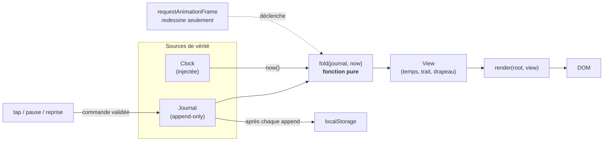
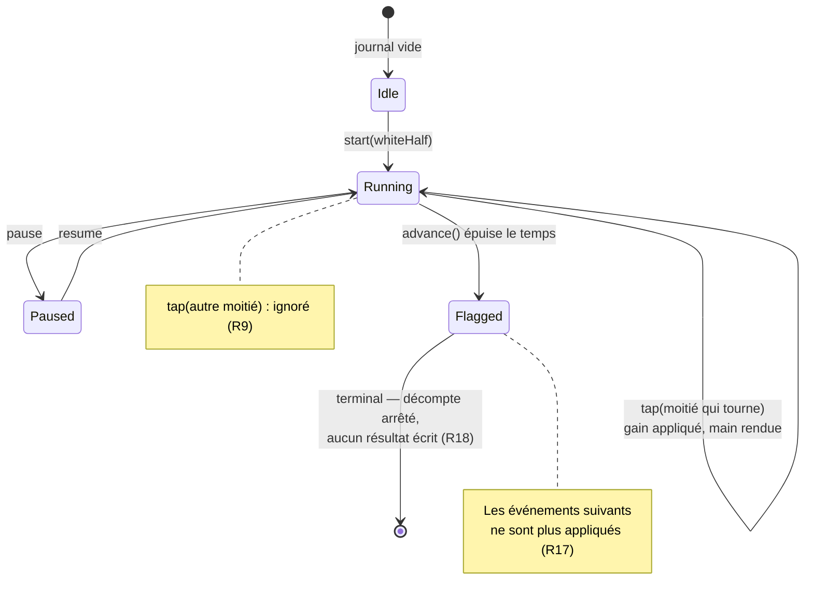

# feat: Pendule d'échecs v1 — journal d'événements et fold pur

## Goal Capsule

Livrer la pendule de myChess telle que spécifiée en R1 à R30 de [`SPECS.md`](../../SPECS.md) : une PWA installable sur Android, posée à plat entre deux joueurs, dont **l'état est un journal d'événements horodatés append-only** et dont **tout l'affichage est dérivé par une fonction pure**. Aucun compteur ne décrémente ; un timer ne sert qu'à redessiner.

Le critère de fin de SPECS n'est pas « les tests passent » mais une partie réelle jouée du début à la fin sur le téléphone. Ce plan livre ce qui est vérifiable en machine (toute la logique de temps, en Vitest, horloge injectée) et rend l'ergonomie conforme à R5–R18 pour validation manuelle.

---

## Problem Frame

Une pendule qui décrémente un compteur dérive. Chrome throttle les timers d'arrière-plan à ~1×/min après cinq minutes : sur une pendule, cette dérive ne produit pas un affichage légèrement faux, elle **fait tomber un drapeau à tort**. Toute l'architecture découle de ce constat unique : la seule chose stockée est la suite des événements et leurs horodatages, et le temps restant est *recalculé* à chaque frame plutôt que *maintenu*. Un fold sur journal est idempotent — le rejouer après vingt minutes d'arrière-plan donne le même résultat qu'en direct, ce qui supprime le besoin d'un chemin de rattrapage séparé.

**Ce qui existe :** rien. Le repo contient `SPECS.md`, `CLAUDE.md`, `README.md` et `docs/ideation/`. Aucun `package.json`, aucun squelette.

---

## Requirements

Traçabilité vers les exigences de `SPECS.md`. Chaque R est porté par au moins une unité d'implémentation.

| R | Exigence (résumé) | Unité |
|---|---|---|
| R1 | Deux modes : Fischer et Bronstein | U2, U3 |
| R2 | Incrément 0 valide (couvre la mort subite) | U3 |
| R3 | Formule unique : `bronstein ? min(increment, elapsed) : increment` | U3 |
| R4 | Temps initial stocké **par joueur** | U2 |
| R5 | Écran coupé en deux moitiés, celle de l'adversaire à 180° | U6 |
| R6 | Chaque moitié est *entièrement* une zone de tap | U6 |
| R7 | En partie, chaque joueur tape **sa propre** moitié | U4, U6 |
| R8 | Démarrage : les Noirs tapent la moitié adverse ; l'orientation s'en déduit | U4, U6 |
| R9 | Tap sur la moitié du joueur pas au trait = aucun effet | U3, U4 |
| R10 | Bande centrale étroite, hors zones de tap, porte la pause | U6 |
| R11 | Reset accessible uniquement depuis l'écran de pause | U6 |
| R12 | Confirmation **visuelle** prioritaire au joueur qui vient de jouer | U7 |
| R13 | Signatures sonores distinctes : dix dernières secondes, chute du drapeau | U7 |
| R14 | Audio pré-armé au premier geste utilisateur | U7 |
| R15 | Interrupteur de mode silencieux | U7 |
| R16 | Son en arrière-plan **non exigé** — limite acceptée | *(aucune)* |
| R17 | Chute du drapeau : décompte arrêté, moitié marquée sans ambiguïté | U3, U7 |
| R18 | **Aucun résultat de partie écrit** | U3, U7 |
| R19 | État = journal d'événements horodatés append-only | U2, U4 |
| R20 | Tout l'affichage dérivé du journal par une fonction pure | U3 |
| R21 | Aucun `setInterval` ne fait avancer le temps ; timer = redessin seul | U6 |
| R22 | Source de temps injectée (interface `Clock`) | U2 |
| R23 | Toute durée est un entier | U2, U3 |
| R24 | Undo du dernier tap | U4 |
| R25 | Journal persisté au fil de la partie | U5 |
| R26 | Reprise proposée à l'ouverture si le journal n'est pas clos | U5, U6 |
| R27 | Lecture de sauvegarde pure, séparée du stockage, hydratation défensive | U5 |
| R28 | Journal exportable, rejouable tel quel comme cas de test | U5 |
| R29 | Presets dans un JSON versionné éditable à la main | U2 |
| R30 | Dernière cadence mémorisée et proposée par défaut | U5 |

---

## Key Technical Decisions

**KTD1. Pas de framework UI — TypeScript nu.** *(session-settled: user-directed — retenu contre Svelte 5 : l'affichage n'a que quatre valeurs dérivées, toutes recalculées par le fold à chaque frame ; une fonction `render(root, view)` idempotente appelée par `requestAnimationFrame` les couvre sans dépendance runtime.)* Écarte au passage le piège « dépendances réactives invisibles » listé dans `CLAUDE.md`, qui a frappé trois fois en une session sur un autre projet.

**KTD2. `Date.now()` comme source de temps, pas `performance.now()`.** `performance.now()` est monotone mais repart de zéro à chaque chargement de page : il ne peut pas mesurer le temps écoulé pendant que l'application était fermée (R26). On prend donc le temps mural, et on se protège du saut d'horloge en arrière dans le fold : chaque avance est `max(0, t - curseur)`, et le curseur lui-même est une **ligne de plus haute eau** (`max(curseur, t)`) — sans quoi le clamp protégerait le pas courant mais laisserait le curseur se poser dans le passé, et l'intervalle suivant surfacturerait le joueur au trait. Symétriquement, la couche commande n'écrit jamais un horodatage antérieur au précédent.

  **Limite connue, non couverte :** un saut d'horloge **vers l'avant** (resynchronisation NTP, réglage manuel) est indiscernable d'un temps réellement écoulé sans référence monotone, et est donc facturé au joueur au trait. Le remède est de dériver les deltas d'une source monotone en ne gardant le temps mural que pour mesurer une absence — c'est un changement de structure, pas un correctif, et il reste à trancher.

**KTD3. Les taps sans effet ne sont pas écrits au journal.** R9 dit qu'un tap sur la moitié du joueur qui n'est pas au trait n'a aucun effet. Un événement sans effet dans un journal append-only est du bruit qui casse l'undo (R24) : « retirer le dernier événement » retirerait un non-événement. La couche commande rejette le tap et n'appose rien. Le fold reste néanmoins tolérant à un tap inapplicable — une sauvegarde d'une version antérieure ou altérée peut en contenir (R27).

**KTD4. Une seule primitive `advance(t)` dans le fold.** Consommer du temps est le *seul* endroit où le temps restant diminue, et le seul endroit où le drapeau tombe. La consommation est plafonnée : `consumed = min(dt, remaining)`. C'est ce plafond qui rend le rejeu après vingt minutes d'arrière-plan identique au direct — le drapeau tombe exactement à l'échéance, pas à la première frame après le retour.

**KTD5. Le temps consommé sur le coup en cours est un accumulateur du fold, pas une soustraction.** Bronstein a besoin d'`elapsed` = temps réellement consommé sur ce coup. Le calculer comme `now - débutDuCoup` compterait le temps de pause. On l'accumule dans `advance()`, donc il n'avance que quand une pendule tourne. C'est ce qui fait que pause+reprise au milieu d'un coup ne fabrique pas de temps en Bronstein.

**KTD6. « Partie close » est dérivé, pas marqué.** R19 interdit d'écrire quoi que ce soit d'autre que des événements. Le seul état terminal est la chute du drapeau, et le fold la calcule. Aucun événement `end`, aucun drapeau booléen persisté. La reprise (R26) est proposée quand un journal existe et que son fold n'est pas en état de drapeau tombé.

**KTD7. Les signaux sonores se déclenchent sur une transition entre deux vues, pas sur une horloge.** `render` compare la vue précédente à la vue courante : franchissement du seuil des dix secondes, apparition du drapeau. Aucun `setTimeout` audio à armer, donc rien à annuler sur undo, pause ou reprise — la cohérence est gratuite.

**KTD8. Wake lock et packaging PWA sont dans le lot, hors R1–R30.** *(session-settled: user-approved)* Sans wake lock l'écran s'éteint pendant une réflexion longue ; sans manifest ni service worker, « Ajouter à l'écran d'accueil » ne produit qu'un raccourci navigateur. Ni l'un ni l'autre n'est une exigence numérotée, mais le critère de fin de SPECS — une partie réelle jouée du début à la fin sur le téléphone — n'est atteignable sans eux. Portés par U8, isolés pour rester retirables.

---

## High-Level Technical Design

*Guidance directionnelle, pas spécification d'implémentation.*

### Flux de données



Le seul lien entre le timer et le temps est indirect : `requestAnimationFrame` déclenche un recalcul, il n'incrémente rien. Retirer la boucle rAF gèlerait l'affichage sans fausser d'un millimètre l'état de la pendule.

### Machine à états du fold



### La formule de gain — R3, une seule expression

```
// À la validation d'un tap, avant de rendre la main :
gain = mode === 'bronstein' ? min(increment, elapsedThisMove) : increment
remaining[cédant] += gain
elapsedThisMove = 0
```

Incrément 0 (R2) rend `gain = 0` dans les deux branches : la mort subite tombe des deux modes sans code dédié. Aucune des deux branches n'est un cas particulier de l'autre.

### Squelette du fold

```
fold(journal, now):
  état ← initial(journal.timeControl)      // remaining par moitié, running=null
  pour chaque événement e du journal :
    si état.flagged : arrêter
    advance(état, e.at)
    appliquer(état, e)                     // ignore ce qui ne s'applique pas
  si non flagged : advance(état, now)
  retourner vue(état)

advance(état, t):
  dt ← max(0, t - état.curseur)            // KTD2 : jamais négatif
  si état.running ≠ null :
    consumed ← min(dt, état.remaining[running])
    état.remaining[running] -= consumed
    état.elapsedThisMove += consumed       // KTD5
    si état.remaining[running] === 0 : état.flagged ← running ; état.running ← null
  état.curseur ← t
```

---

## Output Structure

```
myChess/
├── package.json
├── pnpm-lock.yaml
├── tsconfig.json
├── vite.config.ts                    # config Vite + Vitest + vite-plugin-pwa
├── index.html
├── public/
│   ├── icon-192.png
│   └── icon-512.png
└── src/
    ├── main.ts                       # câblage : storage réelle, Clock réelle, boucle rAF
    ├── domain/
    │   ├── types.ts                  # Half, IncrementMode, TimeControl, ClockEvent, Journal, View
    │   ├── clock.ts                  # interface Clock + SystemClock
    │   ├── fold.ts                   # LE fold pur (R20)
    │   ├── fold.test.ts
    │   ├── commands.ts               # start/tap/pause/resume/undo → nouveau journal ou refus
    │   └── commands.test.ts
    ├── persistence/
    │   ├── codec.ts                  # serialize / parse purs, hydratation défensive (R27)
    │   ├── codec.test.ts
    │   ├── store.ts                  # adaptateur localStorage injectable
    │   └── replay.test.ts            # rejoue des journaux exportés (R28)
    ├── presets/
    │   ├── time-controls.json        # JSON versionné éditable à la main (R29)
    │   └── presets.ts                # chargement + validation
    ├── ui/
    │   ├── layout.css                # deux moitiés + bande centrale, rotation 180°
    │   ├── render.ts                 # render(root, view) idempotent
    │   ├── format.ts                 # formatage mm:ss / ss.d depuis des ms entières
    │   └── format.test.ts
    ├── audio/
    │   └── cues.ts                   # pré-armement + deux signatures distinctes
    └── platform/
        └── wakeLock.ts               # acquisition / relâche / ré-acquisition
```

Déclaration de périmètre, pas contrainte : les listes `**Files:**` par unité font foi.

---

## Implementation Units

### U1. Bootstrap du projet

**Goal :** un `pnpm test` et un `pnpm dev` qui tournent sur un squelette vide, en TypeScript strict.

**Requirements :** aucune R directement — socle des autres unités.

**Dependencies :** aucune.

**Files :** `package.json`, `pnpm-lock.yaml`, `tsconfig.json`, `vite.config.ts`, `index.html`, `src/main.ts`, `.gitignore` *(déjà présent — vérifier qu'il couvre `node_modules/`, `dist/`, `dev-dist/`)*

**Approach :**
1. `pnpm init`, puis dépendances de développement : `vite`, `typescript`, `vitest`. Pas de dépendance runtime (KTD1).
2. `tsconfig.json` en `strict: true` avec `noUncheckedIndexedAccess` et `exactOptionalPropertyTypes` — le fold indexe des `Record<Half, number>` et l'hydratation défensive de R27 travaille sur de l'`unknown`.
3. Config Vitest **dans** `vite.config.ts` (une seule config), environnement `node` par défaut ; les rares tests qui touchent au DOM déclarent `// @vitest-environment jsdom` en tête de fichier.
4. Scripts : `dev`, `build`, `preview`, `test`, `test:watch`, `typecheck`.

**Patterns to follow :** aucun local (repo vierge). Respecter `CLAUDE.md` — pas de commentaire décoratif, commenter seulement le *pourquoi* non évident.

**Test scenarios :** `Test expectation: none -- unité de scaffolding, aucun comportement.`

**Verification :** `pnpm test` sort en succès sur zéro test ; `pnpm typecheck` est vert ; `pnpm dev` sert une page blanche sans erreur console.

---

### U2. Modèle du journal, `Clock` injectée, presets

**Goal :** poser les types qui rendent les erreurs de R4, R22 et R23 impossibles à écrire.

**Requirements :** R1, R4, R19, R22, R23, R29.

**Dependencies :** U1.

**Files :** `src/domain/types.ts`, `src/domain/clock.ts`, `src/presets/time-controls.json`, `src/presets/presets.ts`

**Approach :**
1. `Half = 'top' | 'bottom'` — la pendule ne connaît pas les échecs, elle connaît deux moitiés physiques. Le rattachement Blancs/Noirs se déduit de l'événement `start` (R8) et ne sert qu'à choisir le temps initial par joueur (R4).
2. `TimeControl` porte `initialMs: { white: number; black: number }` — deux champs dès la v1, même si aucune interface ne les règle séparément (R4 : un handicap doit se réduire à exposer un champ, jamais à migrer un schéma).
3. `ClockEvent` en union discriminée : `start` (porte `whiteHalf`), `tap` (porte `half`), `pause`, `resume`. Tous portent `at: number`. Pas d'événement `end` (KTD6).
4. `Journal = { version: 1; timeControl: TimeControl; events: readonly ClockEvent[] }`. Le `readonly` fait porter l'append-only par le typage.
5. `interface Clock { now(): number }`. `SystemClock` renvoie `Math.floor(Date.now())` — le plancher est appliqué **à la frontière**, une seule fois, pour que R23 n'ait plus jamais à être vérifiée en aval.
6. `time-controls.json` : `{ "version": 1, "presets": [...] }` avec au minimum blitz 3+2 Fischer, blitz 5+0 Fischer, rapide 10+5 Fischer, blitz 3+2 Bronstein. `presets.ts` valide à la lecture et laisse échouer bruyamment un JSON malformé — c'est une donnée source versionnée, pas une entrée utilisateur.

**Test scenarios :**
- Le chargement des presets accepte `time-controls.json` tel qu'il est versionné et rend au moins un preset de chaque mode.
- Un preset dont `incrementMs` est négatif ou non entier est rejeté à la validation.
- `SystemClock.now()` rend un entier (`Number.isInteger`) sur plusieurs appels successifs.

**Verification :** `pnpm typecheck` vert ; tenter de muter `journal.events` est une erreur de compilation.

---

### U3. Le fold — dérivation pure de la vue

**Goal :** la fonction qui tient tout le projet : `fold(journal, now) → View`, pure, idempotente, sans lecture d'horloge interne.

**Requirements :** R1, R2, R3, R9, R17, R18, R20, R23.

**Dependencies :** U2.

**Files :** `src/domain/fold.ts`, `src/domain/fold.test.ts`

**Approach :**
1. Signature `fold(journal: Journal, now: number): View`. Aucun appel à `Date.now()`, aucun accès au stockage, aucun effet.
2. `View` expose : `remaining: Record<Half, number>`, `running: Half | null`, `flagged: Half | null`, `phase: 'idle' | 'running' | 'paused' | 'flagged'`, `whiteHalf: Half | null`, `lastTapAt: number | null`, `elapsedThisMove: number`. **Aucun champ `winner`, `result` ou `loser`** (R18) — la pendule constate, elle n'arbitre pas.
3. `advance(t)` est la seule fonction qui décrémente et la seule qui pose le drapeau (KTD4), avec `dt = max(0, t - curseur)` (KTD2) et `consumed = min(dt, remaining)`.
4. `elapsedThisMove` s'accumule dans `advance` (KTD5), pas par soustraction de timestamps.
5. Le tap applique la formule unique de R3 telle qu'écrite dans le HTD, puis remet `elapsedThisMove` à zéro et rend la main.
6. Une fois `flagged` posé, la boucle d'événements s'arrête : les événements postérieurs ne sont plus appliqués (R17).
7. Le fold ignore les événements inapplicables — tap sur une moitié qui ne tourne pas (R9), `resume` sans `pause`, `start` en double — sans jeter. Un journal hydraté depuis une sauvegarde altérée doit produire une vue, pas une exception (R27).

**Execution note :** unité de logique de domaine à contrat clair — écrire les tests d'abord, en commençant par les deux parties complètes Fischer et Bronstein qui cadrent la formule.

**Patterns to follow :** aucun local. `CLAUDE.md` §« Le temps ne se décrémente jamais » fait foi en cas de doute.

**Test scenarios :**
- **Fischer, partie complète** : 3+2, dix demi-coups aux durées variées, horloge injectée avancée pas à pas ; les deux temps restants à chaque tap égalent `initial - consommé + 2000×nbCoups` exactement.
- **Bronstein, partie complète** : 3+2, coups plus courts que l'incrément **et** plus longs que l'incrément dans la même partie ; un coup de 800 ms rend 800 ms, un coup de 5 000 ms rend 2 000 ms.
- **Incrément nul (R2)** : `incrementMs = 0`, mêmes séquences dans les deux modes ; le temps restant décroît strictement et les deux modes produisent des résultats identiques.
- **Formule non greffée (R3)** : pour un même journal, la différence Fischer − Bronstein sur un coup court vaut exactement `increment − elapsed` ; pour un coup long, elle vaut 0.
- **Tap sans effet (R9)** : tap sur la moitié à l'arrêt ; la vue est inchangée à `now` égal et le trait n'a pas basculé.
- **Chute du drapeau à l'échéance exacte** : `remaining` vaut 5 000 ms, `now` avance de 4 999 ms → pas de drapeau ; de 5 000 ms → drapeau, `remaining` exactement 0, jamais négatif.
- **Tap trois millisecondes avant l'échéance** : tap à `échéance − 3`, le gain est appliqué et la partie continue ; tap à `échéance + 3`, le drapeau était déjà tombé et le tap n'a aucun effet.
- **Arrière-plan long (R21)** : journal identique, folder à `now` puis à `now + 20 min` sans aucun événement intermédiaire ; le drapeau tombe à l'échéance exacte, pas au retour, et l'autre moitié est intacte.
- **Idempotence** : appeler `fold` cinq fois de suite avec le même `now` rend des vues profondément égales ; appeler avec des `now` croissants ne rend jamais un `remaining` croissant hors gain de tap.
- **Pause exclue de Bronstein (KTD5)** : coup de 800 ms interrompu par une pause de 30 s ; le gain Bronstein est 800 ms, pas 2 000.
- **Pause / reprise** : aucun temps consommé entre `pause` et `resume`, quel que soit l'écart des horodatages.
- **Saut d'horloge en arrière (KTD2)** : `now` inférieur au dernier horodatage ne rend jamais de temps ; `remaining` est stable.
- **Durées entières (R23)** : sur une partie complète avec horodatages entiers, tous les `remaining` de toutes les vues satisfont `Number.isInteger`.
- **Aucun résultat (R18)** : après chute du drapeau, la vue n'expose ni `winner` ni `result` ni `loser` ; assertion sur les clés de l'objet, pas sur une valeur.
- **Journal incohérent** : `resume` sans `pause`, deux `start`, tap avant `start` ; le fold rend une vue exploitable sans jeter.

**Verification :** tous les scénarios ci-dessus passent ; une recherche de `Date.now` et de `setInterval` dans `src/domain/` ne rend rien.

---

### U4. Commandes du journal — start, tap, pause, resume, undo

**Goal :** la seule couche autorisée à faire grandir le journal, et à refuser ce qui n'a pas d'effet.

**Requirements :** R7, R8, R9, R19, R24.

**Dependencies :** U3.

**Files :** `src/domain/commands.ts`, `src/domain/commands.test.ts`

**Approach :**
1. Chaque commande a la forme `(journal, at, …) → Journal | null` — `null` signifie « refusée, rien à écrire » (KTD3). Le journal rendu est un nouvel objet ; l'entrée n'est jamais mutée.
2. `start(journal, at, tappedHalf)` : R8, les Noirs tapent la moitié adverse. La moitié tapée est donc celle des Blancs, et c'est elle qui part. L'orientation des deux camps se déduit de ce seul événement — aucun écran ne demande qui est Blanc.
3. `tap(journal, at, half)` : R7, valide seulement si `fold(journal, at).running === half`. Sinon `null` (R9).
4. `pause` / `resume` : refusés quand ils sont sans objet (pause d'une pendule déjà en pause, reprise d'une pendule qui tourne).
5. `undo(journal)` : retire le **dernier** événement s'il s'agit d'un `tap` (R24). Ne s'appuie sur aucun état sauvegardé — le rejeu du journal amputé restitue le temps exact parce que le fold est pur. Refusé si le dernier événement n'est pas un tap.
6. Toutes les commandes sont refusées après chute du drapeau, **`undo` compris**.

  *Corrigé en revue — la première rédaction de ce plan autorisait l'undo après la chute, au motif qu'« on a pu taper trop tard ». C'est faux : un tap postérieur à la chute est déjà refusé, donc il n'y a rien à annuler. Le seul cas où l'undo post-drapeau agit vraiment est celui où il retire le tap qui **précède** la chute — ce qui rend la main au cédant depuis son propre tap et lui fait payer la réflexion de son adversaire. Le drapeau tombe alors sur l'autre joueur. Un geste, irréversible, qui change le perdant.*

**Test scenarios :**
- **Démarrage et orientation (R8)** : un tap de démarrage sur `top` fait de `top` la moitié des Blancs et lance `top` ; le même tap sur `bottom` produit l'orientation miroir.
- **Un seul démarrage** : un second `start` sur un journal déjà démarré est refusé et ne grossit pas le journal.
- **Tap légal (R7)** : le tap du joueur qui tourne rend la main et ajoute exactement un événement.
- **Tap illégal (R9)** : le tap de l'autre joueur rend `null` et le journal est **identiquement** le même objet — vérifier la longueur *et* la référence.
- **Undo puis rejeu (R24)** : partie Fischer de six demi-coups, `undo` du dernier tap, puis re-tap au **même** horodatage ; la vue résultante est profondément égale à celle d'avant l'undo.
- **Undo restitue le temps exact** : après `undo`, `fold(journal, at)` à l'horodatage d'avant le tap rend exactement la vue d'avant le tap, incrément inclus.
- **Undo en chaîne** : deux `undo` successifs remontent de deux taps ; un `undo` sur un journal dont le dernier événement est `pause` est refusé.
- **Undo après chute du drapeau** : le tap qui précède la chute est annulable, et le drapeau retombe au rejeu si l'on refolde à un `now` postérieur — la pendule reste cohérente, elle ne « sauve » personne.
- **Append-only** : après n'importe quelle séquence de commandes, le tableau d'événements du journal initial est inchangé (aucune mutation en place).

**Verification :** tous les scénarios passent ; `commands.ts` n'importe rien de `persistence/` ni de `ui/`.

---

### U5. Persistance, reprise et export

**Goal :** survivre à la fermeture de l'application, et rendre un bug de club reproductible en test.

**Requirements :** R25, R26, R27, R28, R30.

**Dependencies :** U4.

**Files :** `src/persistence/codec.ts`, `src/persistence/codec.test.ts`, `src/persistence/store.ts`, `src/persistence/replay.test.ts`, `src/persistence/__fixtures__/` *(journaux exportés servant de cas de test)*

**Approach :**
1. `codec.ts` est **pur** et ne connaît pas `localStorage` (R27) : `serialize(journal): string` et `parse(raw: unknown): ParseResult`, où `ParseResult` est `{ ok: true; journal } | { ok: false; reason }`. `parse` accepte de l'`unknown`, pas une `string` — le stockage n'est pas la seule source (un journal exporté collé dans un test entre par la même porte).
2. Hydratation défensive : absence, chaîne non-JSON, JSON valide de forme inattendue, `version` inconnue, tableau d'événements tronqué en plein milieu, événement au type inconnu. Un journal **tronqué reste exploitable** — c'est une suite append-only, la couper produit une partie plus courte, pas une partie invalide. Une *corruption structurelle* rend `{ ok: false }` et la reprise n'est pas proposée.
3. `store.ts` : adaptateur mince derrière une interface injectable `{ read(key), write(key, value), remove(key) }`, pour que les tests n'aient jamais besoin de jsdom. Écriture après **chaque** événement appendé (R25) — un journal fait quelques centaines d'octets, la question du coût ne se pose pas.
4. Reprise (R26) : au démarrage, lire, parser, folder. Un journal dont le fold n'est pas en `flagged` est proposé à la reprise (KTD6). La reprise restitue l'état exact, y compris le temps écoulé pendant l'absence — c'est le fold qui s'en charge, il n'y a aucun code de rattrapage à écrire.
5. Export (R28) : `serialize` rend une chaîne JSON, copiée dans le presse-papiers depuis l'écran de pause. Le format d'export **est** le format de stockage, sans transformation : un journal exporté se rejoue tel quel.
6. R30 : identifiant de la dernière cadence utilisée dans une clé séparée, proposé par défaut au lancement suivant.

**Test scenarios :**
- **Aller-retour** : `parse(serialize(journal))` rend un journal profondément égal.
- **Reprise après fermeture (R26)** : sérialiser à `t0` en pleine partie, reparser, folder à `t0 + 45 min` ; le temps du joueur au trait a bien été consommé pendant l'absence, et le drapeau est tombé si l'échéance était dépassée.
- **Sauvegarde absente (R27)** : `parse(null)` et `parse(undefined)` rendent `{ ok: false }` sans jeter.
- **Sauvegarde non-JSON** : une chaîne arbitraire rend `{ ok: false }` sans jeter.
- **Journal tronqué** : la chaîne sérialisée coupée en plein tableau d'événements rend `{ ok: false }` ; un journal **structurellement valide mais amputé de ses derniers événements** rend `{ ok: true }` et folde en une partie plus courte cohérente.
- **Schéma de version antérieure** : `version: 0` rend `{ ok: false }` avec une raison nommant la version.
- **Événement de type inconnu** : un journal contenant un `{ type: 'byoyomi' }` est rejeté ou l'événement est écarté — dans les deux cas le fold reste défini.
- **Cadence corrompue** : `initialMs` manquant, négatif ou fractionnaire → `{ ok: false }`.
- **Rejeu d'un journal exporté (R28)** : un fichier de `__fixtures__/` est lu, parsé et foldé ; les temps attendus sont assertés. Ce test **est** la démonstration que R28 marche.
- **Partie close non proposée (KTD6)** : un journal dont le drapeau est tombé n'est pas proposé à la reprise.
- **Dernière cadence (R30)** : après une partie en 5+0, le lancement suivant propose 5+0 par défaut ; un identifiant de cadence inconnu retombe sur le premier preset.

**Verification :** `codec.ts` ne référence ni `localStorage`, ni `window`, ni `globalThis` ; les tests de `persistence/` tournent en environnement `node` sans jsdom.

---

### U6. Coque UI — deux moitiés, bande centrale, boucle de redessin

**Goal :** la disposition physique de R5 à R11, et la boucle qui redessine sans jamais faire avancer le temps.

**Requirements :** R5, R6, R7, R8, R9, R10, R11, R21, R26, R30.

**Dependencies :** U5.

**Files :** `index.html`, `src/ui/layout.css`, `src/ui/render.ts`, `src/ui/format.ts`, `src/ui/format.test.ts`, `src/main.ts`

**Approach :**
1. `index.html` porte la structure statique : `#half-top`, `#band`, `#half-bottom`. `render` ne crée aucun nœud, il met à jour `textContent` et `classList` — idempotent par construction.
2. Grille : `grid-template-rows: minmax(0, 1fr) auto minmax(0, 1fr)` sur `100dvh`. La bande centrale a une hauteur fixe explicite (≈ 48 px) : c'est cette hauteur fixe qui protège de l'écrasement que `minmax(0, 1fr)` autorise à côté d'une piste `auto` (piège listé dans `CLAUDE.md`). Tester sur les **deux** axes.
3. `#half-top` porte `transform: rotate(180deg)` (R5). La moitié entière est la cible de tap (R6) : le gestionnaire est sur le conteneur de la moitié, aucun contrôle secondaire à l'intérieur.
4. Taps : écouter `pointerdown` et non `click` — sur une pendule, le délai compte, et `click` attend le relâchement. `touch-action: manipulation` et `user-select: none` sur les moitiés pour supprimer le délai de double-tap et la sélection de texte parasite.
5. La bande centrale est **hors** des deux zones de tap (R10) et porte la pause. Elle intercepte ses propres événements : vérifier explicitement qu'elle ne vole aucun tap et qu'un tap sur une moitié tout contre la bande passe bien à la moitié.
6. Écran de pause en superposition : reprendre, reset (R11 — le reset n'est atteignable que d'ici, jamais en un geste), export du journal (R28), interrupteur silencieux (R15), choix de cadence (R30).
7. Boucle : `requestAnimationFrame` recalcule `view = fold(journal, clock.now())` puis appelle `render`. **R21 rendu structurel** : la boucle ne détient aucun état de temps ; elle ne fait qu'appeler une fonction pure. Suspendre la boucle sur `visibilitychange` caché et la relancer au retour économise la batterie sans rien changer à l'état — c'est précisément la propriété que le fold garantit. Libérer l'identifiant rAF au démontage (piège `CLAUDE.md`).
8. `format.ts` : au-dessus de 20 s, `m:ss` ; en dessous, `ss.d` (dixièmes) — le dixième n'apparaît que là où il sert. Formatage depuis des ms entières, jamais de `toFixed` sur un flottant accumulé.
9. Au lancement : si un journal reprenable existe (U5), proposer la reprise avant d'afficher une pendule neuve (R26).

**Execution note :** l'ergonomie ne se prouve pas en test. Livrer conforme, lister explicitement ce qui reste à valider au téléphone.

**Test scenarios :**
- `format(180000)` → `3:00` ; `format(19900)` → `19.9` ; `format(0)` → `0.0`.
- Le formatage ne rend jamais de valeur négative ni de `NaN` pour une entrée entière, y compris `0`.
- Le seuil de bascule `m:ss` → `ss.d` est franchi au bon millième, pas un tick trop tôt.
- *(jsdom, marqué en tête de fichier)* `render` appelé deux fois avec la même vue laisse le DOM identique — idempotence.
- *(jsdom)* Un `pointerdown` sur la moitié à l'arrêt ne modifie pas le journal (R9 au niveau UI, pas seulement domaine).

**Verification :** vérification manuelle au téléphone (voir Verification Contract) ; `grep -rn "setInterval" src/` ne rend rien.

---

### U7. Retours — confirmation visuelle, sons, drapeau

**Goal :** traiter le faux négatif de R12, et signaler sans arbitrer.

**Requirements :** R12, R13, R14, R15, R17, R18.

**Dependencies :** U6.

**Files :** `src/audio/cues.ts`, `src/ui/render.ts` *(modifié)*, `src/ui/layout.css` *(modifié)*, `src/domain/fold.ts` *(modifié : exposer `lastTapAt`)*

**Approach :**
1. **R12, la confirmation prioritaire va au cédant, en visuel sur sa propre moitié.** Le fold expose `lastTapAt` ; `render` en dérive un état de flash court (≈ 200 ms) sur la moitié qui vient de s'arrêter — un aplat franc, pleine surface, perceptible en vision périphérique sans fixer l'écran. **Dérivé, pas timer** : le flash est une fonction de `now - lastTapAt`, donc un undo ou une reprise ne laissent aucun `setTimeout` orphelin (KTD7). En régime permanent, le cadran à l'arrêt reste visiblement figé (contraste bas) face au cadran actif (contraste haut) : c'est ce contraste qui rend le faux négatif — le tap qui n'a pas pris — visible du coin de l'œil, alors que la main est déjà repartie vers les pièces.
2. **R13, deux signatures sonores distinctes** : entrée dans les dix dernières secondes, et chute du drapeau. Timbres franchement différents (hauteur et enveloppe), pas deux variantes du même bip. Déclenchement sur **transition entre vue précédente et vue courante** (KTD7) : le seuil des dix secondes se franchit une fois et une seule, y compris après un retour d'arrière-plan où la transition est franchie « dans le passé ».
3. **R14, pré-armement** : l'`AudioContext` est créé et repris (`resume()`) sur le premier `pointerdown`, c'est-à-dire le tap de démarrage — l'API l'exige. `cues.ts` reçoit une fabrique d'`AudioContext` en paramètre plutôt que de la lire globalement, pour rester testable et remplaçable.
4. **R15, mode silencieux** : interrupteur sur l'écran de pause, persisté (U5). Coupe *tous* les sons ; ne coupe pas les retours visuels.
5. **R16 explicitement hors périmètre** : aucun travail. Chrome gèle une page cachée après quelques minutes et la Web Audio ne peut pas y démarrer un son. Limite acceptée, à ne pas « corriger » par un service worker ou une notification.
6. **R17** : la moitié dont le drapeau est tombé est marquée sans ambiguïté — aplat rouge pleine surface, `0.0` figé. Le décompte est déjà arrêté par le fold ; l'UI ne fait que le montrer.
7. **R18** : rien d'autre n'est affiché. Pas de « Blancs gagnent », pas de couronne, pas de bandeau de résultat. La pendule ne voit pas l'échiquier — FIDE art. 6.9, et en blitz l'Appendice B fait dépendre la chute d'une réclamation, pas d'un constat d'appareil.

**Test scenarios :**
- **Transition des dix secondes** : deux vues successives encadrant le seuil produisent exactement un déclenchement ; deux vues successives déjà toutes deux sous le seuil n'en produisent aucun.
- **Franchissement pendant l'arrière-plan** : la vue passe de 30 s à drapeau tombé en une seule transition ; le signal de drapeau part, et le signal des dix secondes ne part pas en double.
- **Signatures distinctes** : les deux signaux se déclenchent par des chemins différents et l'assertion porte sur l'identifiant du signal émis, pas seulement sur le fait qu'un son a été demandé.
- **Mode silencieux (R15)** : silencieux actif, aucun signal n'est émis alors que les mêmes transitions se produisent ; les retours visuels restent inchangés.
- **Pré-armement (R14)** : la fabrique d'`AudioContext` est appelée au premier geste et **une seule fois** sur toute la partie.
- **Flash dérivé (R12)** : `flashHalf` est non nul pour `now - lastTapAt < seuil` et nul au-delà, sur la seule moitié du cédant ; après `undo`, il suit le nouveau `lastTapAt` sans état résiduel.
- **Aucun résultat (R18)** : après drapeau, le DOM rendu ne contient aucun des mots de résultat ; assertion sur le texte rendu.

**Verification :** perceptibilité du flash et distinction des timbres → vérification manuelle au téléphone ; le reste par les tests ci-dessus.

---

### U8. Wake lock et packaging PWA

**Goal :** rendre le critère de fin de SPECS atteignable — une partie réelle, du début à la fin, sur le téléphone.

**Requirements :** hors R1–R30 (KTD8, décidé en session). Sert le §Cadre de SPECS et son critère de fin.

**Dependencies :** U7.

**Files :** `src/platform/wakeLock.ts`, `vite.config.ts` *(modifié)*, `index.html` *(modifié)*, `public/icon-192.png`, `public/icon-512.png`

**Approach :**
1. **Wake lock** : `navigator.wakeLock.request('screen')` à l'entrée en partie, relâché à la pause et à la chute du drapeau, ré-acquis sur `visibilitychange` visible — le verrou est perdu quand l'onglet passe en arrière-plan, l'API l'impose. Dégrader silencieusement quand l'API est absente : c'est un confort, pas un prérequis fonctionnel. Isolé dans son propre module pour rester retirable en une suppression d'import.
2. **PWA** : `vite-plugin-pwa` en preset `generateSW`, manifest `display: fullscreen`, `orientation: portrait`, `background_color` / `theme_color` sombres, précache de l'app shell. Deux icônes maskable.
3. `dev-dist/` est déjà couvert par `.gitignore`. Vérifier explicitement qu'un service worker de développement ne sert pas une version périmée pendant la vérification manuelle — un cache périmé sur une pendule fait perdre du temps de diagnostic pour rien.

**Test scenarios :**
- Le module wake lock ne jette pas quand `navigator.wakeLock` est absent, et le signale par une valeur de retour plutôt que par une exception.
- Le verrou est relâché exactement une fois à la pause et à la chute du drapeau ; une double relâche ne jette pas.
- *(vérification manuelle)* Le reste — installation, plein écran, hors-ligne — n'est pas testable en machine.

**Verification :** `pnpm build` produit un `dist/` contenant `manifest.webmanifest` et un service worker ; installation et vérification hors-ligne au téléphone.

---

## Verification Contract

### Testé en machine — Vitest, horloge injectée

C'est le seul domaine purement déterministe du projet, et celui qu'on ne peut pas vérifier à la main : personne ne reproduit un throttling de trente minutes, un tap trois millisecondes avant l'échéance, ou une reprise depuis un journal tronqué.

Les sept scénarios exigés, et l'unité qui les porte :

| Scénario exigé | Unité |
|---|---|
| Fischer sur une partie complète | U3 |
| Bronstein sur une partie complète | U3 |
| Incrément nul | U3 |
| Undo puis rejeu | U4 |
| Mise en arrière-plan longue | U3 |
| Reprise après fermeture | U5 |
| Journal tronqué / corrompu | U5 |

### Vérifié à la main sur le téléphone — non couvert par les tests

Un audit mobile nomme les éléments cassés, il ne rend pas un booléen ; et `scrollWidth <= innerWidth` ne prouve rien puisque `overflow-x: hidden` le masque. À contrôler explicitement :

- Les deux moitiés sont atteignables et **pivotées correctement** — la moitié adverse se lit à l'endroit depuis l'autre côté de la table.
- La **bande centrale ne vole aucun tap** : un tap juste au-dessus et juste en dessous de la bande atteint bien la moitié visée.
- La **confirmation visuelle de R12 est perceptible sans fixer l'écran** — le seul vrai test est de taper en regardant l'échiquier.
- Le **reset demande bien deux gestes** (R11) : pause, puis reset.
- Les **deux signatures sonores sont distinguables** en conditions de salle (R13), et le mode silencieux coupe bien tout (R15).
- L'écran **ne s'éteint pas** pendant une réflexion longue (U8).
- **Les deux chemins** : une partie jouée en direct **et** une reprise après mise en arrière-plan / fermeture.
- Un vrai rechargement se prouve en **redémarrant le serveur de développement**, pas avec un `location.reload()` piloté à distance.

---

## Definition of Done

- [ ] `pnpm test` vert, incluant les sept scénarios exigés du Verification Contract.
- [ ] `pnpm typecheck` et `pnpm build` verts.
- [ ] `grep -rn "setInterval" src/` ne rend rien ; `grep -rn "Date.now" src/` ne rend que `src/domain/clock.ts`.
- [ ] Chaque R de R1 à R30 est portée par une unité livrée, R16 exceptée (exigence négative).
- [ ] Aucune vue, aucun DOM rendu ne contient de résultat de partie (R18).
- [ ] Le journal exporté d'une partie se rejoue tel quel dans un test (R28) — le fichier de fixture est versionné.
- [ ] La branche est poussée et la PR ouverte, avec la liste explicite de ce qui n'a pas pu être vérifié en machine.

---

## Scope Boundaries

### Hors périmètre — définitivement écartés (SPECS §Hors périmètre)

Multi-période, et avec elle la machine à états de périodes et le **compteur de coups** dont c'était la seule raison d'être. Délai américain — il produit exactement le même temps restant que Bronstein à chaque fin de coup et ne diffère que par l'affichage pendant le coup. Byo-yomi. Ils sont écartés, pas oubliés : ne pas laisser de crochet « au cas où » dans le modèle.

### Hors périmètre — le répertoire d'ouvertures

Ne pas toucher. C'est la v3, ses questions Q1 et Q3 ne sont pas tranchées, et rien de ce plan ne doit préparer sa structure de données.

### Reporté en v2

Interface de réglage des temps asymétriques — la structure de données est prête (R4), l'écran ne l'est pas. Éditeur visuel de cadences (R29 dit explicitement « pas d'éditeur visuel en v1 »). Import de journal depuis l'application : l'export (R28) suffit à rendre un bug reproductible ; l'import se fait en collant le JSON dans un test.

---

## Risks & Open Questions

**Le mapping moitié ↔ camp est déduit d'un seul tap (R8).** Si les joueurs se trompent au démarrage — les Blancs tapent au lieu des Noirs — l'orientation est inversée pour toute la partie et l'undo ne remonte pas jusqu'au `start`. Mitigation : le reset depuis l'écran de pause reste le recours, et il est à deux gestes par construction (R11). Ne pas ajouter de correctif d'orientation en v1 ; voir si le cas se produit vraiment en usage.

**La perceptibilité du flash de R12 n'est pas prouvable en test.** On teste que l'état dérivé est correct, jamais qu'il est visible du coin de l'œil. C'est le principal point de vérification manuelle, et le plus susceptible de demander un réglage (durée, intensité) après la première partie réelle.

**Le seuil de bascule du formatage (20 s) est un choix, pas une exigence.** Trop tôt, le dixième distrait ; trop tard, on ne le voit pas arriver. À confirmer en usage.

**Le service worker en développement peut servir une version périmée** et faire perdre du temps de diagnostic. Vérifier explicitement à la première vérification manuelle après U8.

---

## Assumptions

- Chrome Android récent : `Screen Wake Lock`, `Web Audio`, `pointerdown`, `dvh` et les service workers sont disponibles. Aucun polyfill, aucun support de navigateur ancien — c'est une application pour un seul appareil.
- Les horodatages du journal sont en millisecondes epoch entières, produites par la seule `SystemClock`.
- Aucune CI n'existe sur ce repo et ce plan n'en ajoute pas. Les commandes de vérification sont exécutées localement.

---

## Sources & Research

- [`SPECS.md`](../../SPECS.md) — exigences R1 à R30, périmètre, section « Vérifier ». Document d'origine.
- [`CLAUDE.md`](../../CLAUDE.md) — contraintes techniques dures, pièges connus (dépendances réactives, blowout de grille, cascade CSS, nettoyage des timers), vocabulaire.
- Versions relevées au 2026-08-08 : Vite 8.2.1, Vitest 4.1.10, TypeScript 7.0.2. Aucune recherche externe : la stack est imposée par SPECS et le repo est vierge de tout motif local à suivre.
- FIDE Laws of Chess art. 6.9 et Appendice B — cités par SPECS comme justification de R18 ; non revérifiés dans cette passe de planification, ils fondent une exigence négative (ne rien afficher) dont le coût d'erreur est nul.
